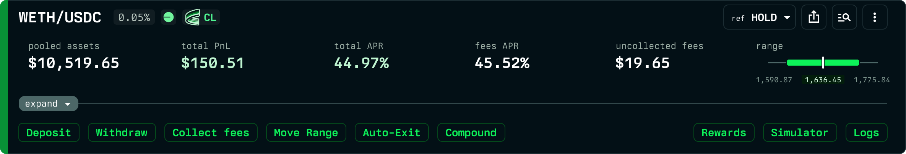

# Aerodrome on Base

Revert supports [Aerodrome Slipstream](https://aerodrome.finance/) concentrated-liquidity positions on Base, with the same tooling you already use for Uniswap, plus the parts that are specific to Aerodrome.

## What you can do

- **Track performance** of your Aerodrome Slipstream positions with Revert's full analytics: PnL, fee APR, rewards APR, impermanent loss, and historical charts.
- **Manage positions** directly from the Revert interface: add or remove liquidity, change ranges, and swap through the best available route.
- **Earn and track AERO rewards.** Aerodrome positions earn AERO emissions when staked in a pool's gauge. Revert stakes your position for you and shows your unclaimed and claimed rewards alongside your fees. See [Staking & AERO rewards](staking-and-rewards.md).
- **Auto-compound your AERO.** Reinvest emitted AERO back into your position automatically, growing your liquidity over time without manual steps. See [AERO auto-compounding](aero-auto-compounding.md).
- **Automate ranges and exits.** Auto-Range and Auto-Exit work on Aerodrome positions the same way they do on Uniswap.
- **Borrow against your position.** Use an Aerodrome position as collateral in [Revert Lend](../revert-lend/README.md) on Base, and keep earning AERO while you borrow. See [Using staked positions as collateral](staked-lp-as-collateral.md).

## What's different about Aerodrome

On Uniswap, a position earns swap fees only. On Aerodrome, a staked position earns **AERO emissions** through the pool's gauge instead of swap fees: staked liquidity's trading fees go to veAERO voters, so a position earns either fees (unstaked) or AERO (staked), never both. To make those rewards work for you without extra clicks, Revert takes custody of the staked position through its GaugeManager contract so it can claim rewards, compound them, and keep the position staked, all while you retain full control to manage, withdraw, or borrow against it at any time.

The Aerodrome-specific topics are covered here:

- [Staking & AERO rewards](staking-and-rewards.md)
- [AERO auto-compounding](aero-auto-compounding.md)
- [Using staked positions as collateral](staked-lp-as-collateral.md)

All Aerodrome contracts and their audit are listed in [Contract Addresses](../resources/contract-addresses.md) and [Security](../resources/security.md).
