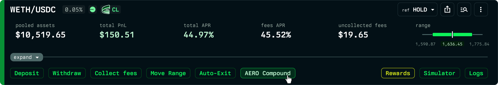
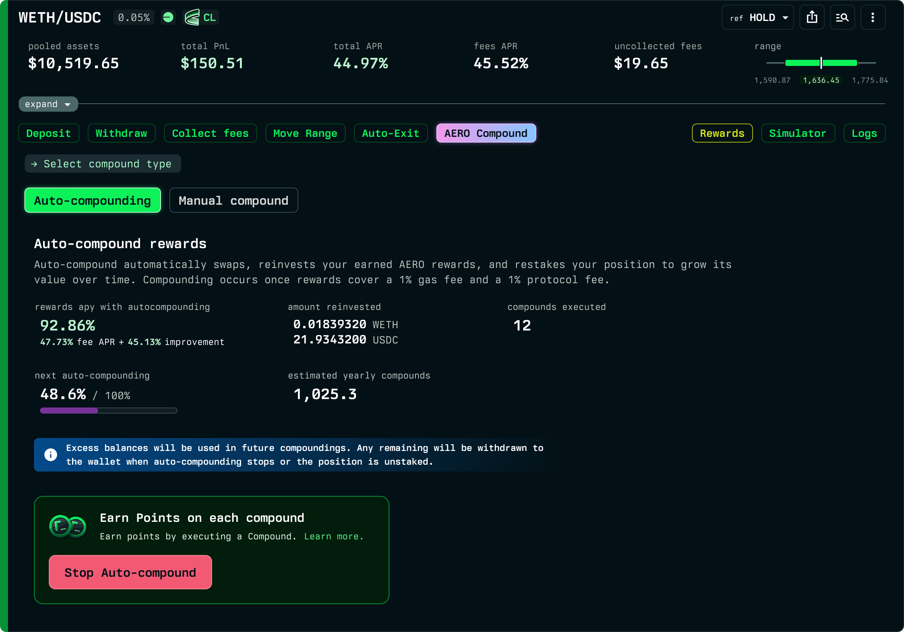

# AERO auto-compounding

Auto-compounding on Aerodrome reinvests the AERO emissions your position earns back into the position, automatically and at optimal times. Your liquidity grows over time without you having to claim, swap, and re-deposit by hand.

This is the Aerodrome counterpart to the [Auto-compounder](../auto-compounder/README.md) you may already use for Uniswap fees. The difference is what gets compounded: on Uniswap it is the accrued swap fees, while on Aerodrome it is the **AERO rewards** emitted by the gauge.

## How it works

Once enabled, the auto-compounder periodically:

1. **Claims** the AERO emissions accrued to your position.
2. **Swaps** the AERO into the position's tokens at the right ratio for its current range.
3. **Reinvests** the result as additional liquidity in the position.
4. **Restakes** the position so it keeps earning emissions.

All of this happens automatically in a single transaction, performed by the Revert protocol's audited contracts, so you never need to act yourself. Auto-compounding only reinvests your rewards back into your own position; it cannot move your funds anywhere else.

## When it compounds

A compound only happens when it is worthwhile. Compounding occurs once the accrued rewards are large enough to cover a **1% gas fee** and a **1% protocol fee**. This makes sure small amounts are not compounded at a loss to gas, and that compounding happens at efficient times relative to your rewards.

## Tracking compounds

On the position page, the auto-compound panel shows:

- **Rewards APY with auto-compounding** and the improvement over not compounding.
- **Amounts reinvested** - the token amounts that have been compounded back into the position.
- **Auto-comps executed** - how many times your position has been compounded.

These figures update as compounds happen, so you can see the effect on your position over time.

## Managing auto-compounding

You can enable or disable auto-compounding from the position page at any time. While a position is auto-compounding you can still manage it normally: add or remove liquidity, change its range, or use it as collateral in [Revert Lend](../revert-lend/README.md).

