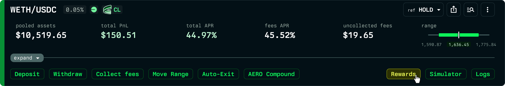

# Staking & AERO rewards

Aerodrome rewards liquidity providers with AERO emissions instead of swap fees. A position earns one or the other, never both: while staked in the pool's gauge it earns AERO emissions and its share of trading fees goes to veAERO voters; while unstaked it earns swap fees and no emissions. This differs from PancakeSwap, where staked positions earn both CAKE and trading fees.

Emissions are only paid to staked positions, so Revert handles staking for you: your position earns rewards from the moment it is created, and those rewards are shown on the position page.

## How staking works on Revert

When you create or deposit an Aerodrome position through Revert, the position is staked in the corresponding Aerodrome gauge. To do this on your behalf while keeping your funds safe, the staked position is held by Revert's **GaugeManager** contract, which is the custody layer for Aerodrome on Revert.

This is what lets Revert:

- Claim AERO emissions for your position.
- Auto-compound those emissions back into the position (see [AERO auto-compounding](aero-auto-compounding.md)).
- Keep the position staked and earning while you manage it, change its range, or use it as collateral in Revert Lend.

You keep full control of the position at all times. You can withdraw, remove liquidity, or stop using Revert's tooling whenever you choose.

## Tracking your rewards

On the position page you will see, alongside your fees:

- **Unclaimed rewards** - AERO that has accrued to your position and is not yet claimed.
- **Claimed rewards** - AERO that has already been claimed for the position, including amounts that were claimed and reinvested by auto-compounding.

Reward values are shown in AERO and in your reference currency, and are included in the position's rewards APR so you can compare opportunities on a like-for-like basis.

## Claiming

Rewards are claimed for you as part of normal operations such as auto-compounding, range changes, or withdrawals. The claimed amounts are recorded in the position's history so your reward earnings are always reflected in your performance figures.
