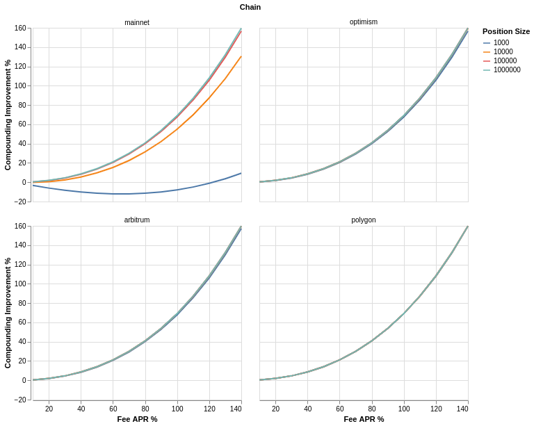

# Performance improvement

The increase in performance due to compounding fees will be widely different across positions, and in some cases, the gas costs of compounding the fees may not be offset by the increased fees collected due to the compounding effect for more than a year.

**Costs of Compounding**

We can estimate the costs of compounding fees without using the auto-compounder on Mainnet (25 Gwei), Polygon (50 Gwei), Optimism (0.25 Gwei), and Arbitrum (0.2 Gwei) as per the following table\[^2]. Assuming separate transactions and ETH price of $1000 and MATIC price of $0.5. For Optimism and Arbitrum estimated Gwei amounts were used to avoid doing L2 gas price calculation.

| Function      | Gas cost | Mainnet | Optimism | Arbitrum | Polygon |
| ------------- | -------- | ------- | -------- | -------- | ------- |
| Collect       | 124,000  | $3.10   | $0.03    | $0.02    | $0.003  |
| Swap          | 184,523  | $4.61   | $0.05    | $0.04    | $0.004  |
| Add liquidity | 216,912  | $5.42   | $0.05    | $0.04    | $0.005  |
| Total         | 525,435  | $13.13  | $0.13    | $0.10    | $0.012  |

Likewise we can estimate the gas costs for compounding a position using the Compoundor contract on the same chains as shown below.

| Function      | Gas cost | Mainnet | Optimism | Arbitrum | Polygon |
| ------------- | -------- | ------- | -------- | -------- | ------- |
| Auto-Compound | 479,521  | $11.99  | $0.12    | $0.10    | $0.01   |

**Estimating Benefits of Auto-compounding**

We define the relevant parameters for our estimations as follows:

_**P =**_ Principal amount (current value of LP position) _**APR =**_ annual percentage rate from fees only (fee APR) _**GASCOST =**_ current gas costs of compounding fees _**PREWARD =**_ fraction of compounded fees paid to the protocol _**CREWARD =**_ fraction of the compounded fees paid to the account that calls the contract function and pays for the gas. This value is always equal or less than _**PREWARD**_, as it defines the fraction of the protocol rewards assigned to the caller.

**Number of Yearly Compoundings**

To estimate the number of compoundings the protocol would execute for a given position we assume that auto-compounding happens when the compounder reward, which is a fraction of the uncollected fees, reaches the gas cost for executing the operation. In practice, the number of compoundings will be slightly lower because _**compoundors**_ will execute the function when it is profitable.

The number of compoundings that will be executed is a function of the estimated APY, this makes calculating these values self-referential. One way to approximate the number of compoundings is to compute the APY assuming continuous compounding which gives us an upper bound, to get a lower bound we can calculate the number of compoundings possible given the non-compounded APR. In reality the real value will fall between these bounds, for the purposes of our calculations we use $n\_{min}$ which is precise enough for realistic P and APR values.

**Estimated APY**

To calculate the projected APY for an auto-compounded position we use the formula for compound interest with the estimated number of compoundings per year, and we subtract the protocol reward from the APR.

**Compounding Improvement**

The expected improvement in performance for a position during a 1 year period is the difference between the APY and the APR.

The below chart uses the estimated gas cost values from the table above and values of _**PREWARD=0.02**_, _**CREWARD=0.01**_ to estimate APY improvements, over a 1 year period, from compounding for positions of sizes 1k USD, 10k USD, 100k USD, and 1m USD.

**A worked example**

Take a $10,000 position earning a 20% fee APR, so $2,000 per year in fees, with PREWARD = 0.02 and CREWARD = 0.01. A compound fires when the executor's share of pending fees (1%) covers the gas:

- On a chain where a compound costs $0.05 of gas, the trigger is $5 of pending fees: hundreds of compounds a year, effectively continuous compounding. Projected APY is roughly 21.7% against the 20% simple rate.
- At $12 of gas, the trigger is $1,200 of pending fees: fewer than two compounds a year, for an APY around 20.4%.
- The same parameters on a $1,000 position at $12 gas never reach the trigger at all. The auto-compounder costs nothing in that case, but it also never fires.

**When not to compound**

If your position is small, your fee APR modest, and your chain's gas expensive, the improvement rounds to zero, and the table above lets you compute exactly that before activating anything. Compounding also grows your exposure to the pair: every compounded dollar is new capital subject to divergence loss. If you would not add fresh capital to the pool today, collecting the fees is the consistent choice. See the [Compound or collect](../playbooks/compound-or-collect.md) playbook for the full decision.
