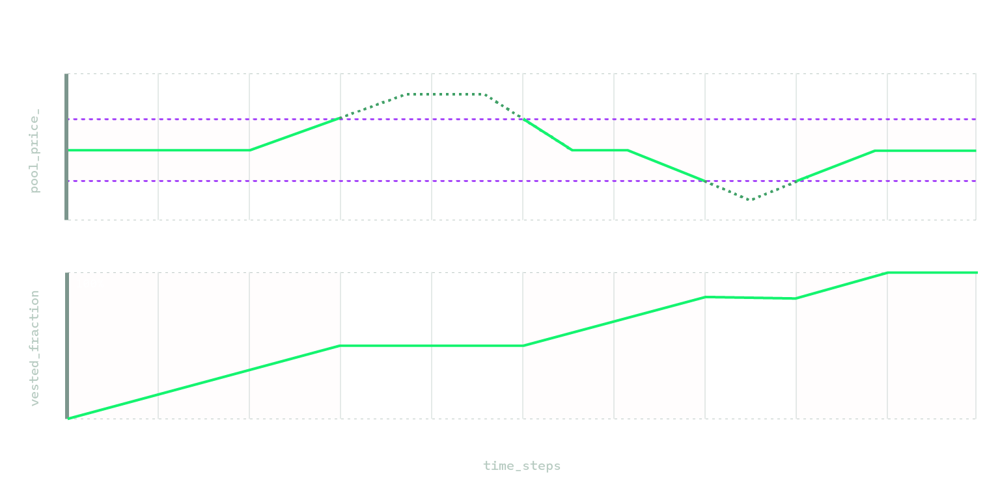

# Time-vested v3 Staker

The time-vesting uniswap staker is a [fork of the Uniswap v3 staker ](https://mirror.xyz/revertfinance.eth/pUufXuRkUHjrV_oq0bq2sunvQ0hz7u529jWDKlQnm-Q)that adds a linear vesting period for positions to receive the full amounts of the accrued rewards.

Linear vesing of rewards is intended to prevent ultra-concentrated liquidity from gaming the incentives and extract most of the rewards.  You can read more about it on this [post](https://mirror.xyz/revertfinance.eth/pUufXuRkUHjrV_oq0bq2sunvQ0hz7u529jWDKlQnm-Q).

<figure><figcaption>
While the incentive rewards accrue proportional to <em>liquidity</em>, in the same way that trading fees do, the vested fraction increases linearly while the position is in range.
</figcaption></figure>

\
\
<mark style="color:green;">→ How does the vesting work?</mark>\
\
The vesting period over which accrued reward are vested is decided by the Incentives program creator. They could be vested over just a few days, which would have been enough to prevent the 1-tick strategy that has dominated previous incentive programs on v3. The vesting period could also be set for the full length of the incentives program, which should incentivize even wider liquidity across the price range.
