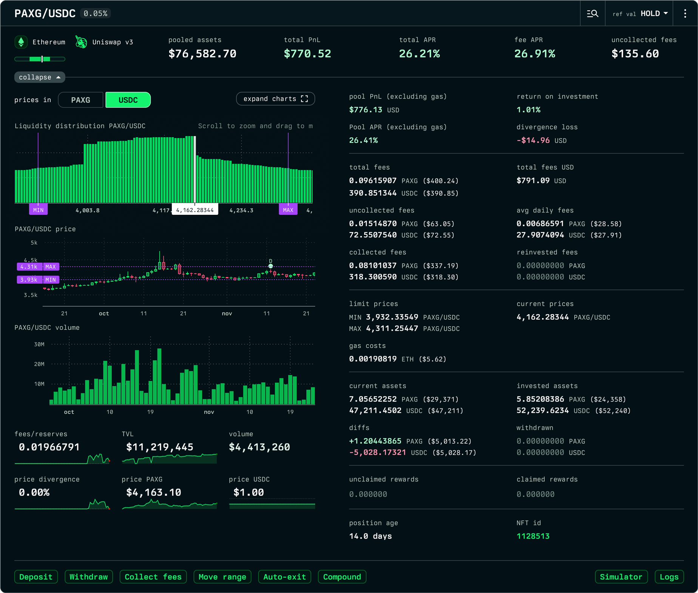

# Uniswap v3 Positions

### Uniswap v3 position definitions

#### pooled assets:

Value in USD of the position.

#### APR:

Annual percentage rate of returns given the current value of the underlying position assets including deposits, withdrawals, gas costs, and staking rewards at current prices.

#### fee APR:

Annual percentage rate of returns considering the accrued fees only. Does not account for divergence loss.

#### APR excluding gas:

Annual percentage rate of returns considering the value of the underlying position and the accrued fees, and divergence loss. Does not account for gas costs.

#### pool PnL:

Profit and loss for the position from only fees accrued and price divergence.

`Pool PnL    = value of current LP underlying tokens` \
&#x20;           `- value of tokens deposited (at current price)` \
&#x20;           `+ value of tokens withdrawn (at current price)`

#### total PnL (vs HOLD):

`Total PnL = USD value of underlying tokens (at current price)`\
&#x20;         `- USD value of tokens deposited (at current price)` \
&#x20;         `+ USD value of tokens withdrawn (at current price)` \
&#x20;         `+ USD value of pending rewards (at current price)`\
&#x20;         `+ USD value of claimed rewards (at current price)`\
&#x20;         `- USD value of gas costs at current ETH price.`

#### total PnL (vs ETH):

`Total PnL = ETH value of underlying tokens (at current price)`\
&#x20;         `- ETH value of tokens deposited (at deposit price)` \
&#x20;         `+ ETH value of tokens withdrawn (at withdrawal price)` \
&#x20;         `+ ETH value of pending rewards (at current prices)` \
&#x20;         `+ ETH value of claimed rewards at (at claim price)` \
&#x20;         `- ETH value of gas costs.`

#### total PnL (vs USD):

`Total PnL = USD value of current underlying tokens` \
&#x20;         `- USD value of tokens deposited (at deposit price)` \
&#x20;         `+ USD value of tokens withdrawn (at withdrawal price)` \
&#x20;         `+ USD value of pending rewards (at current price)` \
&#x20;         `+ USD value of claimed rewards (at claim price)` \
&#x20;         `- USD value of gas costs (at tx price).`

#### current assets:

The amount of underlying tokens corresponding to this LP position.&#x20;

#### invested assets:

The sum of all assets invested in the position.

#### withdrawn:

The sum of all assets withdrawn out of the position.

#### diffs:

The difference between the assets invested, subtracting the assets withdrawn, and the current assets in the LP position.\
\
&#xNAN;_`diffs = current assets - invested assets + withdrawn assets`_

#### **unclaimed rewards:**

The sum of all detected unclaimed staking reward assets for the account and pool.

#### claimed rewards:

The sum of all detected claimed staking reward assets for the account and pool.

### Pool definitions

#### reserves:

USD value of the underlying token reserves for the pool.

#### volume:

USD value of the traded volume for the pool.

#### price divergence:

The running difference between the changes in prices (as percentages) for the underlying assets against the prices 30 days ago. Price divergences between a pair of assets can result in losses for liquidity providers.\
\
`Price Divergence = abs(token0_price_change_pct - token1_price_change_pt)`

#### **position age:**

The amount of time (in days) that have passed since the position was first created.

