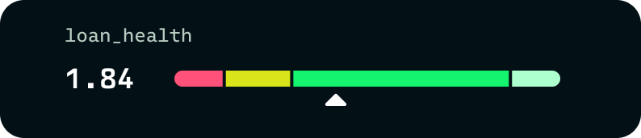

# Borrowing

Your position does not stop working when you borrow against it. Deposit the LP NFT into the vault and borrow USDC in the same transaction. The position stays yours to manage from the normal position page, and it keeps earning while it backs the loan. It remains locked in the vault until the loan is repaid.

<figure><figcaption></figcaption></figure>

### How much you can borrow

Your borrowing power is the position's value scaled by the pair's collateral factor, using the lower of the two tokens' factors. Borrowed funds are issued in the vault's lending asset, USDC, and are yours to deploy immediately.

### Interest

The borrow rate floats with utilization of the lending pool and accrues continuously into your debt balance. There is no fixed term and no repayment schedule. The only standing requirement is that the loan stays healthy.

### Loan health

Loan health is one comparison: collateral value, after collateral factors, against outstanding debt.

<figure><figcaption></figcaption></figure>

Three things move it:

- **Interest** grows the debt side continuously.
- **Pool prices and divergence loss** move the collateral side, in both directions.
- **Your own actions**: adding liquidity or repaying widens the gap; withdrawing or borrowing more narrows it.

While the collateral value exceeds the debt, the loan is in good standing. If the debt crosses above the collateral value, the loan becomes liquidatable: see [Liquidations](liquidations.md) for exactly what happens then and what it costs. Watching the gap, and knowing which of the three inputs is moving it, is the whole job of managing a loan.
