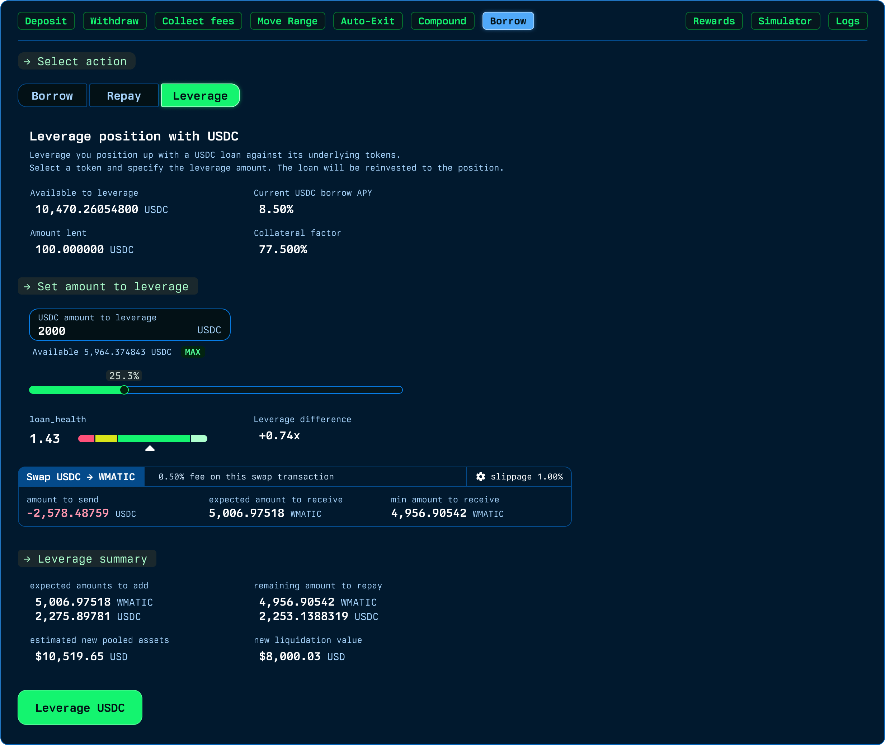

# Leverage

### What Is Leverage?

Leverage in the Revert Lend protocol refers to the strategy of amplifying a user’s exposure to market positions by borrowing additional tokens against their collateral and reinvesting those tokens into their position. This allows users to control a larger position than they would with their original capital, potentially increasing their returns. However, leveraging also increases risk, as losses can be magnified just as much as gains.

### Borrow, Swap, and Reinvest

1. **Borrow**: The process begins with the user depositing their Uniswap v3 LP position as collateral into the Vault. Based on the value of this collateral and the protocol’s collateral factor, the user can borrow additional tokens from the lending pool. These borrowed tokens are typically issued in a protocol-determined ERC-20 token, like USDC.
2. **Swap**: After borrowing the tokens, the user may choose to swap these borrowed tokens into other assets if needed. This step is crucial for aligning the borrowed assets with the assets in the user’s LP position. For example, if the borrowed tokens are in USDC but the user’s LP position is in ETH/DAI, the user might swap the USDC for ETH or DAI to reinvest in the LP position.
3. **Reinvest**: The final step in leveraging is reinvesting the borrowed and swapped tokens back into the Uniswap v3 LP position. By adding these additional tokens to their existing position, the user effectively increases their exposure to the liquidity pool, thus leveraging their initial investment. This larger position can yield higher returns from trading fees and potential price appreciation, but it also comes with greater risk if the market moves unfavorably.

In summary, leveraging in the Revert Lend protocol involves borrowing additional tokens against your LP position, possibly swapping those tokens for the assets needed, and then reinvesting them to increase the size of your position. This strategy can significantly enhance returns but requires careful management to avoid the increased risks associated with leverage.

<figure><figcaption></figcaption></figure>

