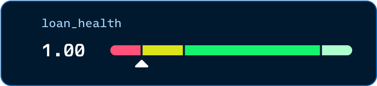

# Liquidations

Liquidation is not an event that strikes from nowhere. It is a distance you can read and manage: the gap between your collateral value, after collateral factors, and your debt.

### Position health

A loan is healthy while the collateral value exceeds the debt. The gap closes from two directions: interest accrues into the debt continuously, and the collateral side moves with pool prices and divergence loss. When the debt crosses above the collateral value, the loan becomes liquidatable.

<figure><figcaption></figcaption></figure>

### What a liquidation costs you

Any account can liquidate an unhealthy loan: the liquidator repays your outstanding debt and receives collateral worth the debt plus a liquidation penalty. The penalty ranges from 2% to 10% of the debt value, scaling with how far the debt has run past the collateral value, so a loan caught just past the line costs far less than one deep underwater.

If the position is still worth more than your debt plus the penalty, the liquidator takes that much and the remainder is returned to you: you lose the penalty and keep the rest. That is the good case, and it depends on being liquidated in time. If a fast move pushes your debt plus penalty above the position's entire value, there is no remainder: the liquidator takes the whole position and you get nothing back, and the shortfall becomes bad debt that the pool's reserves, and ultimately lenders, absorb. Liquidation defends the pool's solvency, not your residual value. The only reliable protection is managing the distance before you reach the line.

### Liquidator bots

Liquidation is open and permissionless by design. Revert publishes an open-source reference bot at the [liquidator-js repository](https://github.com/revert-finance/liquidator-js) and runs it as a backstop, but anyone can operate one, and we encourage it: more independent liquidators means unhealthy debt is cleared faster and the lending pool stays solvent for everyone.
