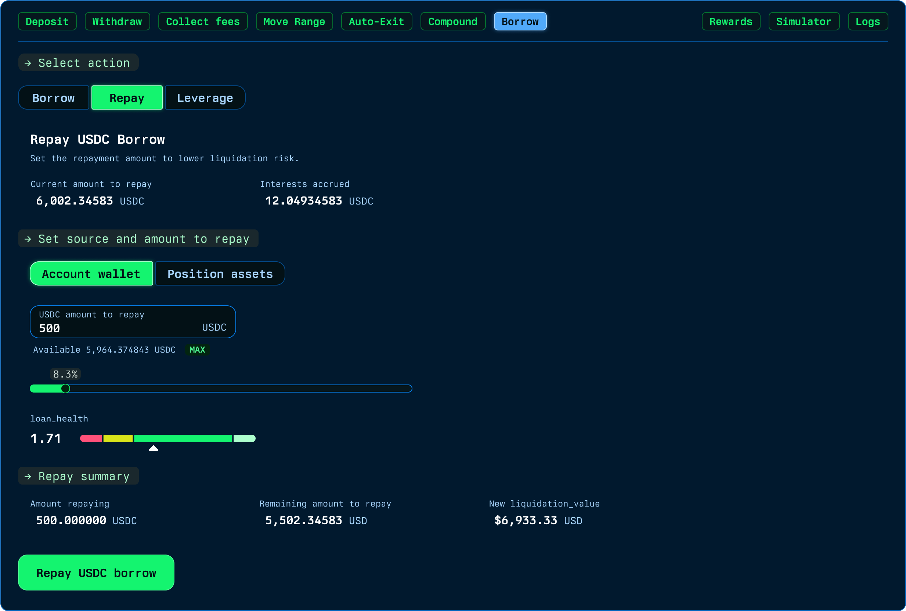
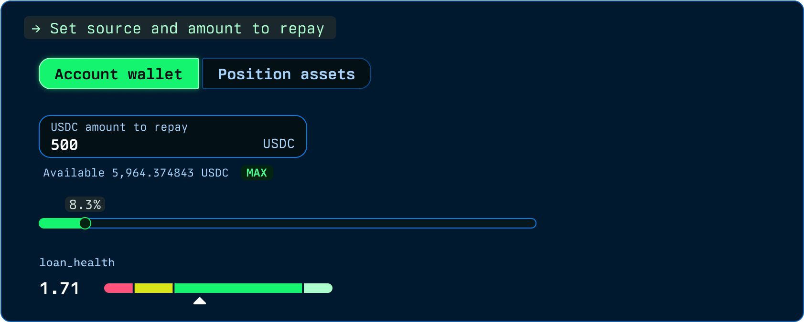
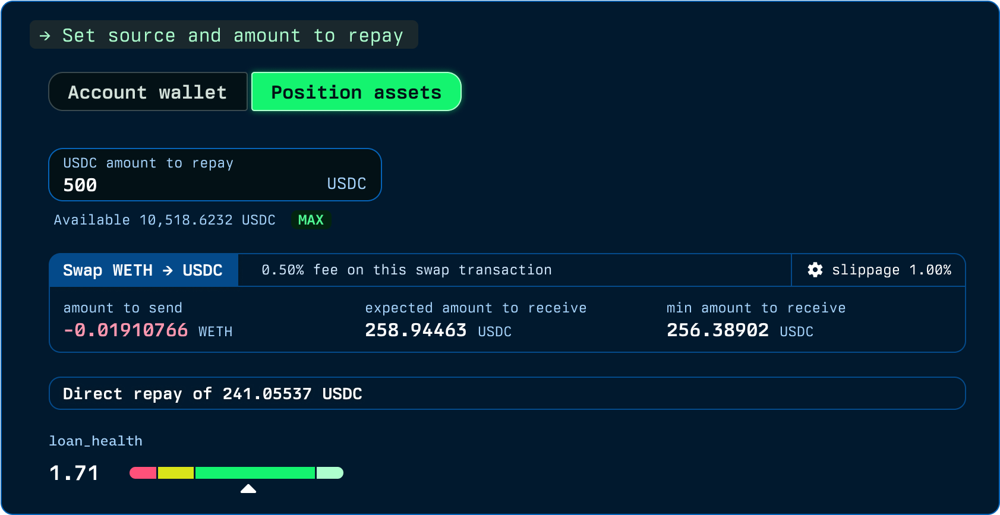

# Repaying

Repay any amount at any time. There is no schedule and no penalty for early repayment: your debt is simply the borrowed amount plus accrued interest, tracked by the debt exchange rate, and every repayment reduces it directly.

<figure><figcaption></figcaption></figure>

### Repaying from the collateral

You do not need outside funds to deleverage. Part of the position itself can be swapped into the borrowed token and used to repay, atomically in a single transaction. This is the lever that lets you cut debt in response to market moves without touching your wallet.

<figure><figcaption></figcaption></figure>

<figure><figcaption></figcaption></figure>

### Closing out

Once the debt is fully repaid, including accrued interest, the position is released from the vault back to your full control: manage it, move it, or withdraw it as you see fit.
